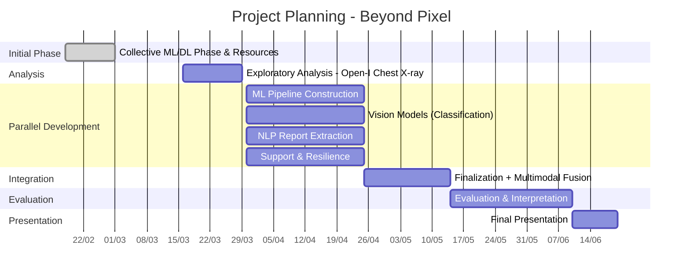

## Planning

<table>
  <thead>
    <tr>
      <th>Task</th>
      <th>Responsible</th>
      <th>Details</th>
      <th>Date (Planned)</th>
      <th>Date (Completed)</th>
    </tr>
  </thead>
  <tbody>
    <tr>
      <td>Collective ML/DL Phase & Resources</td>
      <td>All</td>
      <td>Reading books/resources (StatLearning, scikit-learn, D2L, PyTorch videos, Hugging Face)</td>
      <td>Feb 18 – Mar 1</td>
      <td></td>
    </tr>
    <tr>
      <td>Exploratory Analysis – Open-I Chest X-ray</td>
      <td>All</td>
      <td>Cleaning, statistics, distribution, data quality analysis + literature review</td>
      <td>Mar 16 – Mar 29</td>
      <td></td>
    </tr>
    <tr>
      <td>ML Pipeline Construction</td>
      <td>Member 1</td>
      <td>Dataset download, preprocessing, training, evaluation, interpretation</td>
      <td>Mar 30 – Apr 25</td>
      <td></td>
    </tr>
    <tr>
      <td>Vision Models (Classification)</td>
      <td>Member 2</td>
      <td>Image preprocessing, augmentation, validation, transfer learning</td>
      <td>Mar 30 – Apr 25</td>
      <td></td>
    </tr>
    <tr>
      <td>NLP Report Extraction</td>
      <td>Member 3</td>
      <td>Tokenization, information extraction, language models</td>
      <td>Mar 30 – Apr 25</td>
      <td></td>
    </tr>
    <tr>
      <td>Support & Resilience</td>
      <td>Members 4 & 5</td>
      <td>Support other members in case of issues, begin integration work</td>
      <td>Mar 30 – Apr 25</td>
      <td></td>
    </tr>
    <tr>
      <td>Individual Finalization + Fusion</td>
      <td>All</td>
      <td>Finalize individual components, start multimodal integration</td>
      <td>Apr 26 – May 14</td>
      <td></td>
    </tr>
    <tr>
      <td>Evaluation & Interpretation</td>
      <td>All</td>
      <td>Systematic model comparison, metrics, explainability, vision/text relationship</td>
      <td>May 15 – Jun 11</td>
      <td></td>
    </tr>
    <tr>
      <td>Final Presentation</td>
      <td>All</td>
      <td>Prepare slides, rehearsals, supervisor feedback</td>
      <td>Jun 11 – End</td>
      <td></td>
    </tr>
  </tbody>
</table>

---