# Architecture Logicielle — Pipeline NLP Multi-label

**Projet Open-i · Chest X-ray Report Classification**
Dataset : Indiana University Chest X-ray Collection (~3 955 rapports)

---

## 1. Vue d'ensemble

L'architecture est organisée en **quatre couches** indépendantes. Le pipeline suit trois blocs expérimentaux : TF-IDF + Régression Logistique (Bloc 1), TF-IDF + MLP PyTorch (Bloc 2), puis BERT custom pré-entraîné + classifieur (Bloc 3).

| Couche | Responsabilité | Classes principales |
|--------|---------------|---------------------|
| Data Layer | Chargement, labellisation, préparation | `XMLLoader`, `LabelMapper`, `TFIDFVectorizer`, `NlpDataModule`, `build_tokenizer`, `MLMDataset`, `LabelDataset` |
| Model Layer | Définition des modèles | `SklearnMultiLabel`, `nn.Sequential` (MLP), `Encoder`, `BERTForMLM`, `Classifier` |
| Training Layer | Entraînement et optimisation | `SklearnTrainer`, `train_with_early_stopping()`, `pretrain.py` (MLM), `finetune.py`, `LitClassifier` (K-fold) |
| Evaluation | Métriques et visualisation | `evaluate_model()`, évaluation intégrée dans `finetune.py` et `kfold.py` |

### Diagramme d'architecture

```mermaid
graph LR
    subgraph DATA["Data Layer"]
        direction TB
        XMLLoader["XMLLoader\n---\nparse_xml()\nbuild_dataframe()"]
        LabelMapper["LabelMapper\n---\nmesh_to_labels()\nget_class_weights()"]
        Preproc["Preprocessing\n---\nremovex()\nstopword()\nlemmatizer()\nspaCy en_core_web_sm"]
        TFIDF["TFIDFVectorizer ×2\n---\nindication: 2500\nimpression: 2500\nmin_df=2\nscipy.hstack"]
        DataModule["NlpDataModule\n---\nsparse→tensor\ntrain/val/test split\nDataLoader"]
    end

    subgraph MODELS["Model Layer"]
        direction TB
        SKModel["SklearnMultiLabel\n---\nOneVsRestClassifier\nLogisticRegression\nMaxAbsScaler"]
        MLPModel["nn.Sequential (MLP)\n---\nLinear→ReLU→Dropout→Linear\nBCEWithLogitsLoss + pos_weight"]
    end

    subgraph TRAIN["Training Layer"]
        direction TB
        SKTrainer["SklearnTrainer\n---\ncross_validate()\nRandomizedSearchCV"]
        TorchTrainer["train_with_early_stopping()\n---\nearly stopping (patience)\ngrid search (lr, hidden, pw_clip)"]
    end

    subgraph EVAL["Evaluation"]
        direction TB
        Evaluator["evaluate_model()\n---\nf1_macro/micro/samples\nauc_roc macro/micro/per_label\nhamming_loss\nthreshold optimization\nplots"]
    end

    XMLLoader -->|"DataFrame"| LabelMapper
    LabelMapper -->|"df + 21 labels"| Preproc
    Preproc -->|"texte nettoyé"| TFIDF
    TFIDF -->|"sparse matrix"| SKModel
    TFIDF -->|"sparse matrix"| DataModule
    DataModule -->|"tenseurs + DataLoaders"| MLPModel

    SKModel -->|"utilisé par"| SKTrainer
    MLPModel -->|"utilisé par"| TorchTrainer

    SKTrainer -->|"résultats"| Evaluator
    TorchTrainer -->|"résultats"| Evaluator

    subgraph BERT["Bloc 3 — BERT Custom"]
        direction TB
        MIMIC["MIMIC-CXR\n---\n~227k rapports\n(pré-entraînement)"]
        BPETok["BPE Tokenizer\n---\nbuild_tokenizer()\nvocab=8192\nmax_len=256"]
        BERTEnc["Encoder\n---\n6 layers × 8 heads\nd=256, d_ff=512\nRoPE + RMSNorm + SiLU"]
        MLMHead["BERTForMLM\n---\nMLM pré-entraînement\n15% masking"]
        ClfHead["Classifier\n---\nDropout(0.1) → Linear\n[CLS] pooling"]
        KFold["LitClassifier\n---\n5-fold CV\nPyTorch Lightning"]
    end

    MIMIC -->|"textes"| BPETok
    BPETok -->|"tokenizer.json"| MLMHead
    MLMHead -->|"bert_pretrained.pt"| BERTEnc
    XMLLoader -->|"DataFrame"| LabelMapper
    BERTEnc -->|"encodeur gelable"| ClfHead
    ClfHead -->|"fine-tuning"| KFold
    KFold -->|"résultats"| Evaluator
```



---

## 2. Data Layer

### 2.1 XMLLoader

Parse les ~3 955 fichiers XML Open-i. Produit un DataFrame (`uid`, `indication`, `findings`, `impression`).

- **`parse_xml()`** — extrait INDICATION, FINDINGS et IMPRESSION.
- **`build_dataframe()`** — construit le DataFrame consolidé avec préfixe UID (`"CXR" + uid`) pour compatibilité TorchXRayVision.

### 2.2 LabelMapper

Mapping déterministe MeSH → pathologies (dictionnaire Cohen et al. / TorchXRayVision). Produit **21 colonnes binaires**.

- **`mesh_to_labels()`** — convertit les termes MeSH en vecteurs multi-label binaires.
- **`get_class_weights()`** — calcule les poids inverses de fréquence pour `BCEWithLogitsLoss`.

### 2.3 Preprocessing (spaCy)

Pipeline de nettoyage textuel appliqué à `indication` et `impression` :

1. **`removex()`** — supprime les placeholders (`xxxx`, `XXXX`, `year`, `years`, `old`).
2. **`stopword()`** — supprime stop words et ponctuation via spaCy (`en_core_web_sm`).
3. **`lemmatizer()`** — lemmatisation via spaCy.

### 2.4 Vectorisation TF-IDF

Deux `TfidfVectorizer` indépendants, concaténés via `scipy.hstack` :

| Champ | max_features | min_df | stop_words |
|-------|-------------|--------|------------|
| `indication` | 2500 | 2 | english |
| `impression` | 2500 | 2 | english |

Résultat effectif : **1 432 features** (après filtrage `min_df=2`).

### 2.5 BPE Tokenizer (Bloc 3 — `model.py`)

Tokenizer BPE entraîné from scratch sur les rapports MIMIC-CXR via la bibliothèque HuggingFace `tokenizers` :

- **`build_tokenizer(texts, vocab_size=8192, max_len=256)`** — entraîne un tokenizer BPE avec `ByteLevel` pre-tokenizer.
- Tokens spéciaux : `[PAD]`, `[UNK]`, `[CLS]`, `[SEP]`, `[MASK]`.
- Post-processing : insertion automatique de `[CLS]` et `[SEP]` via `TemplateProcessing`.
- Padding et troncation activés (max_length=256).
- Sauvegardé en `tokenizer.json` pour réutilisation en fine-tuning.

### 2.6 MLMDataset (Bloc 3 — `model.py`)

Dataset PyTorch pour le pré-entraînement MLM (Masked Language Modeling) :

- Masquage aléatoire de 15% des tokens (hors tokens spéciaux).
- Stratégie de remplacement : 80% `[MASK]`, 10% token aléatoire, 10% inchangé.
- Les tokens non masqués reçoivent le label `-100` (ignorés par `cross_entropy`).

### 2.7 LabelDataset (Bloc 3 — `model.py`)

Dataset PyTorch pour le fine-tuning multi-label :

- Encode les textes via le tokenizer pré-entraîné.
- Labels : tenseur `float` multi-label (vecteur binaire par rapport).
- `pad_collate()` : collate function avec padding dynamique au max du batch.

### 2.8 NlpDataModule (Bloc 2)

Gère la conversion sparse → tenseurs PyTorch et la création des DataLoaders :

```python
class NlpDataModule():
    def __init__(self, X_sparse, y, batch_size=64, test_size=0.2, val_size=0.1, random_state=42)
```

- Split : 80/10/10 via `train_test_split` (seed=42).
- `_to_tensor()` : `sparse.toarray()` → `torch.float32`.
- `get_dataloader(split)` : retourne un `DataLoader` avec `pin_memory` si GPU.
- Tailles : Train=2 847 | Val=317 | Test=791.

---

## 3. Model Layer

### 3.1 SklearnMultiLabel (Bloc 1)

**Classification binaire (Normal vs Pathologie) :**
Pipeline `MaxAbsScaler` → `LogisticRegression(solver='saga')`. Optimisation via `RandomizedSearchCV` sur `C`, `penalty` (l1/l2/elasticnet), `l1_ratio`.

**Multi-label (21 pathologies) :**
`OneVsRestClassifier` wrappant la même pipeline. Un classifieur binaire par pathologie avec son propre seuil optimal.

### 3.2 Encoder BERT custom (Bloc 3 — `model.py`)

Encodeur Transformer construit from scratch, inspiré de l'architecture BERT mais avec des composants modernes :

**Composants :**

| Module | Description |
|--------|------------|
| `RoPE` | Rotary Position Embedding — encodage positionnel relatif appliqué aux queries et keys, remplace le positional embedding appris classique |
| `MHA` | Multi-Head Attention — 8 têtes, `scaled_dot_product_attention` (FlashAttention-compatible), avec RoPE |
| `Block` | Pre-norm Transformer block — `RMSNorm → MHA → résiduel → RMSNorm → FFN(SiLU) → résiduel` |
| `Encoder` | Stack de 6 `Block`, embedding + norm finale `RMSNorm` |

**Configuration :**

| Paramètre | Valeur |
|-----------|--------|
| `d` (dimension) | 256 |
| `h` (têtes) | 8 |
| `N` (couches) | 6 |
| `d_ff` (FFN) | 512 |
| `V` (vocabulaire) | 8192 |
| Params total | ~4.9M |

**`BERTForMLM`** — Wrapper pour le pré-entraînement MLM : `Encoder → Linear(d,d) → GELU → RMSNorm → Linear(d,V)`.

**`Classifier`** — Wrapper pour le fine-tuning multi-label : `Encoder → [CLS] pooling → Dropout(0.1) → Linear(d, n_labels)`. Utilise la représentation du token `[CLS]` (position 0) comme embedding de la séquence.

### 3.3 MLP (Bloc 2 — `nn.Sequential`)

**Baseline :** `Linear(1432, 256) → ReLU → Linear(256, 21)` — sans dropout, 10 epochs.

**Modèle optimisé (grid search) :** `Linear(1432, hidden) → ReLU → Dropout(0.3) → Linear(hidden, 21)`

| Hyperparamètre | Espace de recherche | Meilleure config |
|----------------|---------------------|------------------|
| `hidden` | {64, 128, 256} | **64** |
| `lr` | {1e-4, 5e-4, 1e-3} | **1e-3** |
| `pw_clip` | {1, 2, 5, 10, 20} | **20** |

- Loss : `BCEWithLogitsLoss` avec `pos_weight` (poids inverses de fréquence, clippés à `pw_clip`).
- Optimizer : `Adam`.

---

## 4. Training Layer

### 4.1 SklearnTrainer (Bloc 1)

- **`cross_validate()`** — StratifiedKFold, `scoring='roc_auc'`.
- **`RandomizedSearchCV`** — grille séparée pour l1/l2 (sans `l1_ratio`) et elasticnet (avec `l1_ratio`).

> `l1_ratio` ne doit apparaître dans la grille qu'avec la pénalité `elasticnet`. Le mélanger avec `l1`/`l2` fait échouer tous les fits.

### 4.2 train_with_early_stopping (Bloc 2)

```python
def train_with_early_stopping(model, loss_fn, optimizer, patience=5, max_epochs=100):
```

- Sauvegarde le meilleur modèle (`best.pt`) selon la validation loss.
- Early stopping : patience=5 (grid search), patience=10 (retrain final).
- Retourne `train_losses`, `val_losses` pour les plots.

**Grid search :** 45 combinaisons (3 lr × 3 hidden × 5 pw_clip), chacune entraînée avec early stopping (max 60 epochs). Évaluation sur le val set (F1 macro + AUC macro). Le meilleur modèle est réentraîné avec patience=10 et max_epochs=100.

### 4.3 Pré-entraînement MLM (Bloc 3 — `pretrain.py`)

Pré-entraînement auto-supervisé de l'encodeur BERT sur les rapports MIMIC-CXR (corpus externe, ~227k rapports) via Masked Language Modeling.

| Paramètre | Valeur |
|-----------|--------|
| Dataset | MIMIC-CXR (HuggingFace) |
| Epochs | 20 |
| Learning rate | 3e-4 |
| Batch size | 32 |
| Optimizer | AdamW (weight_decay=0.01) |
| Scheduler | CosineAnnealingLR |
| Gradient clipping | max_norm=1.0 |

**Pipeline :** Entraîne le tokenizer BPE → entraîne `BERTForMLM` → sauvegarde `tokenizer.json` + `bert_pretrained.pt`.

### 4.4 Fine-tuning multi-label (Bloc 3 — `finetune.py`)

Fine-tuning du `Classifier` sur le dataset IU X-Ray avec les poids pré-entraînés. Trois modes de labels :

| Mode | Labels | Description |
|------|--------|-------------|
| 5 | Atelectasis, Cardiomegaly, Consolidation, Edema, Effusion | CheXpert competition (benchmark SOTA) |
| 14 | 14 pathologies NIH | NIH ChestX-ray14 |
| 21 | Tous les labels IU X-Ray | Incluant Normal |

| Paramètre | Valeur |
|-----------|--------|
| Text input | `findings` |
| Epochs | 30 (max) |
| Learning rate | 2e-4 |
| Batch size | 32 |
| Early stopping | patience=5 |
| pos_weight | neg/pos clampé à 5 |
| Freeze encoder | Configurable (`FREEZE_ENCODER`) |
| Split | 80/20 (train/val) |

### 4.5 K-fold Cross-Validation (Bloc 3 — `kfold.py`)

Validation croisée 5-fold avec PyTorch Lightning pour une évaluation robuste du modèle BERT.

- **`LitClassifier`** — Module PyTorch Lightning wrappant `Classifier` :
  - `training_step` / `validation_step` : BCEWithLogitsLoss + pos_weight.
  - `on_validation_epoch_end` : calcul de l'AUC macro sur le fold.
  - `configure_optimizers` : AdamW + CosineAnnealingLR.
- **Text input** : concaténation `indication` + `findings` (vs `findings` seul en finetune).
- **Early stopping** par fold (patience=5 sur `val_loss`).
- **pos_weight** : neg/pos clampé à 20 (calculé sur les cas pathologiques uniquement).
- Chaque fold repart d'une copie fraîche de l'encodeur pré-entraîné (`copy.deepcopy`).
- Les prédictions de tous les folds sont agrégées pour les métriques finales.

---

## 5. Couche d'évaluation

Une seule fonction `evaluate_model()` partagée par les blocs :

| Fonctionnalité | Description |
|----------------|------------|
| Seuil optimal | Recherche exhaustive sur [0.1, 0.55] par pas de 0.05 |
| F1 macro/micro/samples | F1-score sous trois moyennes |
| AUC macro/micro | ROC-AUC (classes avec support > 1 uniquement) |
| AUC par label | AUC individuel par pathologie avec barplot |
| Hamming loss | Erreur label par label |
| Plots | Loss curves, métriques globales (barplot), AUC par label (barplot horizontal) |

---

## 6. Résultats

### Bloc 1 — Régression Logistique

- **Binaire (Normal vs Pathologie)** : AUC = 0.96, Accuracy = 0.90.
- **Multi-label** : AUC variable par pathologie, optimisé via `RandomizedSearchCV`.

### Bloc 2 — MLP

**Baseline (sans dropout, sans pos_weight clipping) :**

| Métrique | Valeur |
|----------|--------|
| F1 macro | 0.4238 |
| F1 micro | 0.5859 |
| AUC macro | 0.8601 |
| Hamming loss | 0.0692 |
| Seuil optimal | 0.55 |

**Modèle optimisé (lr=1e-3, hidden=64, pw_clip=20, dropout=0.3) :**

| Métrique | Valeur |
|----------|--------|
| F1 macro | 0.4133 |
| F1 micro | 0.5874 |
| AUC macro | 0.8643 |
| Hamming loss | 0.0694 |
| Seuil optimal | 0.55 |

Le modèle optimisé améliore légèrement l'AUC macro (+0.004) mais le F1 macro baisse. L'AUC macro de 0.86 confirme que le ranking est bon ; le bottleneck reste le déséquilibre de classes pour les pathologies rares.

---

## 7. Décisions de conception

**Vectorisation indication + impression** — Les deux champs textuels sont vectorisés séparément puis concaténés. `findings` n'est pas utilisé dans le Bloc 2.

**pos_weight avec clipping** — Les poids inverses de fréquence corrigent le déséquilibre mais sont clippés (`pw_clip`) pour éviter une instabilité numérique sur les classes très rares.

**Seuil global optimisé** — Un seuil unique est recherché sur la plage [0.1, 0.55] plutôt qu'un seuil par label, par simplicité.

**Séparation des paradigmes** — Deux approches distinctes : scikit-learn (`fit`/`predict`) pour le Bloc 1 et PyTorch (boucle manuelle) pour le Bloc 2.

**Extensibilité** — Un `ImageDataset` (Phase 3) et un `FusionClassifier` (Phase 4+) pourront s'ajouter sans modifier les couches actuelles.

**Pré-entraînement sur MIMIC-CXR** — L'encodeur BERT est pré-entraîné sur un corpus externe (~227k rapports radiologiques) pour apprendre les représentations du domaine médical avant le fine-tuning sur le petit dataset IU X-Ray (~3 955 rapports). Ce transfer learning domain-specific compense la taille limitée du dataset cible.

**RoPE au lieu de positional embeddings appris** — Les Rotary Position Embeddings offrent une meilleure généralisation aux longueurs de séquences variables et n'ajoutent pas de paramètres apprenables.

**RMSNorm + SiLU** — Choix de normalisation et d'activation modernes (style LLaMA) au lieu de LayerNorm + ReLU/GELU classiques, pour une meilleure stabilité d'entraînement.

**Trois modes de labels (5/14/21)** — Permettent de comparer les performances sur des benchmarks standard (CheXpert-5, NIH-14) en plus de l'évaluation complète (21 labels IU X-Ray).

**K-fold CV avec PyTorch Lightning** — Évaluation robuste évitant le biais d'un seul split train/val, avec gestion propre de l'early stopping et du scheduling par fold.

---

## 8. Déploiement GPU — Infrastructure Télécom

Le passage de Google Colab aux GPU de Télécom implique plusieurs adaptations d'infrastructure, sans changement de code modèle.

### Environnement cible

L'infrastructure GPU de Télécom met à disposition des nœuds de calcul équipés de GPU NVIDIA accessibles via un ordonnanceur de jobs (type SLURM). Contrairement à Colab où l'exécution est interactive dans un notebook, le paradigme devient celui du **batch job** : on soumet un script, il est mis en file d'attente, puis exécuté quand les ressources sont disponibles.

### Transition Colab → Télécom

Le code développé en notebooks Colab doit être converti en **scripts Python autonomes** (`.py`) exécutables en ligne de commande. Les notebooks restent utilisables pour l'exploration et le prototypage, mais l'entraînement final se fait via des scripts soumis à l'ordonnanceur.

Les données Open-i, actuellement sur Google Drive, seront transférées vers le **stockage partagé** du cluster (accessible depuis tous les nœuds de calcul). Les chemins de fichiers seront paramétrés via des arguments CLI ou un fichier de configuration pour éviter les chemins en dur.

### Gestion des ressources GPU

Le Bloc 1 (TF-IDF + scikit-learn) n'a pas besoin de GPU et peut tourner sur CPU. Le Bloc 2 (MLP) bénéficie marginalement d'un GPU vu la taille du modèle. Le code utilise `torch.device("cuda" if torch.cuda.is_available() else "cpu")` pour la portabilité automatique entre les deux environnements. Les checkpoints du modèle (`best.pt` via early stopping) sont sauvegardés pour être récupérés après le job.

### Organisation pratique

Chaque expérience (combinaison d'hyperparamètres) correspond à un job soumis séparément. Les logs et métriques sont écrits dans des fichiers structurés pour permettre la comparaison post-hoc via `evaluate_model()`. Le grid search (45 combinaisons) peut être parallélisé sur plusieurs GPU si disponibles.

---

## 9. Inventaire complet des classes et fonctions

| Élément | Couche | Rôle |
|---------|--------|------|
| `XMLLoader` | Data | Parse les fichiers XML, construit le DataFrame brut |
| `LabelMapper` | Data | Mapping MeSH → 21 pathologies, calcul des poids de classes |
| `removex()` / `stopword()` / `lemmatizer()` | Data | Preprocessing textuel via spaCy |
| `TfidfVectorizer` ×2 | Data | Vectorisation indication + impression, 2500 features chacun |
| `NlpDataModule` | Data | Sparse → tenseurs, splits 80/10/10, DataLoaders PyTorch |
| `SklearnMultiLabel` | Model | OneVsRestClassifier + Pipeline LogisticRegression |
| `nn.Sequential` (MLP) | Model | Linear→ReLU→Dropout→Linear, BCEWithLogitsLoss + pos_weight |
| `RoPE` | Model | Rotary Position Embedding pour l'attention |
| `MHA` | Model | Multi-Head Attention avec RoPE et scaled_dot_product |
| `Block` | Model | Bloc Transformer pre-norm (RMSNorm + MHA + FFN SiLU) |
| `Encoder` | Model | Stack de 6 blocs Transformer, d=256, h=8 |
| `BERTForMLM` | Model | Encoder + tête de prédiction MLM |
| `Classifier` | Model | Encoder + [CLS] pooling + tête de classification multi-label |
| `build_tokenizer()` | Data | Entraîne un tokenizer BPE (vocab=8192, ByteLevel) |
| `MLMDataset` | Data | Dataset MLM avec masquage 15% (80/10/10) |
| `LabelDataset` | Data | Dataset multi-label pour fine-tuning |
| `pad_collate()` | Data | Collate function avec padding dynamique |
| `SklearnTrainer` | Training | Cross-validation, RandomizedSearchCV |
| `train_with_early_stopping()` | Training | Boucle train/val, early stopping, sauvegarde best.pt |
| `pretrain.py` | Training | Pré-entraînement MLM sur MIMIC-CXR, produit tokenizer.json + bert_pretrained.pt |
| `finetune.py` | Training | Fine-tuning multi-label (3 modes : 5/14/21 labels), early stopping |
| `kfold.py` | Training | 5-fold CV avec PyTorch Lightning, `LitClassifier` |
| `evaluate_model()` | Evaluation | F1, AUC, Hamming, threshold search, plots |
