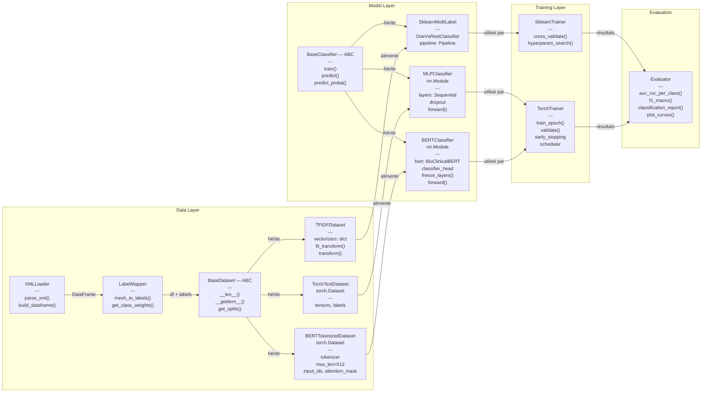

# Architecture Logicielle — Pipeline NLP Multi-label

**Projet Open-i · Chest X-ray Report Classification**
Dataset : Indiana University Chest X-ray Collection (~4 000 rapports) — Phases 1–2

---

## 1. Vue d'ensemble

L'architecture orientée objet est organisée en **quatre couches** indépendantes. Des classes abstraites (ABC) définissent les interfaces communes, garantissant que chaque bloc expérimental (TF-IDF → MLP → BioClinicalBERT) respecte le même contrat : mêmes splits de données, mêmes métriques d'évaluation.

| Couche | Responsabilité | Classes principales |
|--------|---------------|---------------------|
| Data Layer | Chargement, labellisation, préparation | `XMLLoader`, `LabelMapper`, `*Dataset` |
| Model Layer | Définition des modèles | `SklearnMultiLabel`, `MLPClassifier`, `BERTClassifier` |
| Training Layer | Entraînement et optimisation | `SklearnTrainer`, `TorchTrainer` |
| Evaluation | Métriques et visualisation | `Evaluator` (partagé par tous les blocs) |

### Diagramme d'architecture



---

## 2. Data Layer

### 2.1 XMLLoader

Parse les ~4 000 fichiers XML Open-i. Produit un DataFrame (`uid`, `indication`, `findings`).

- **`parse_xml()`** — extrait INDICATION et FINDINGS. IMPRESSION est exclu des inputs (data leakage).
- **`build_dataframe()`** — construit le DataFrame consolidé avec préfixe UID (`"CXR" + uid`) pour compatibilité TorchXRayVision.

### 2.2 LabelMapper

Mapping déterministe MeSH → pathologies (dictionnaire Cohen et al. / TorchXRayVision). Produit 10 colonnes binaires + colonne dérivée `Normal`.

- **`mesh_to_labels()`** — convertit les termes MeSH en vecteurs multi-label binaires.
- **`get_class_weights()`** — calcule les poids inverses de fréquence pour `BCEWithLogitsLoss`.

### 2.3 BaseDataset (ABC)

Interface abstraite commune à tous les datasets :

```python
class BaseDataset(ABC):
    @abstractmethod
    def __len__(self) -> int: ...
    @abstractmethod
    def __getitem__(self, idx): ...
    def get_splits(self, seed=42) -> (train, val, test): ...
```

**Point clé :** `get_splits()` utilise un seed fixe et un split identique (80/10/10). Les mêmes UIDs restent dans les mêmes partitions quel que soit le bloc — indispensable pour comparer équitablement TF-IDF vs MLP vs BERT.

### 2.4 Implémentations concrètes

| Classe | Bloc | Spécificités |
|--------|------|-------------|
| `TFIDFDataset` | Bloc 1 | Deux vectorizers (indication: 2500, findings: 2500), `scipy.hstack`, matrices sparse. `MaxAbsScaler` (pas StandardScaler). |
| `TorchTextDataset` | Bloc 2 | Convertit TF-IDF sparse → tenseurs PyTorch denses. Hérite aussi de `torch.utils.data.Dataset`. |
| `BERTTokenizedDataset` | Bloc 3 | Tokenizer WordPiece (BioClinicalBERT), `max_len=512`. Retourne `input_ids`, `attention_mask`, `labels`. |

---

## 3. Model Layer

### 3.1 BaseClassifier (ABC)

```python
class BaseClassifier(ABC):
    @abstractmethod
    def train(self, data): ...
    @abstractmethod
    def predict(self, X) -> np.ndarray: ...
    @abstractmethod
    def predict_proba(self, X) -> np.ndarray: ...
```

### 3.2 SklearnMultiLabel (Bloc 1)

Encapsule un `OneVsRestClassifier` wrappant un SGDClassifier (pénalité elasticnet). Pipeline intégrant `MaxAbsScaler`. Optimisation via `RandomizedSearchCV` avec subsample strategy.

### 3.3 MLPClassifier (Bloc 2)

Réseau feed-forward héritant de `nn.Module` :

- Architecture : `5000 → 256 → 64 → 10`
- Activations : ReLU
- Régularisation : `Dropout(0.3)`
- Loss : `BCEWithLogitsLoss`

### 3.4 BERTClassifier (Bloc 3)

BioClinicalBERT (pré-entraîné MIMIC-III) + classifier head neuf :

| Composant | Configuration |
|-----------|--------------|
| Couches gelées | Layers 0–9 (frozen) |
| Couches fine-tunées | Layers 10–12 + pooler (`lr = 1e-5`) |
| Classifier head | `768 → 256 → 10` (`lr = 1e-3`) |
| Optimizer | AdamW, deux param groups différenciés |
| Loss | `BCEWithLogitsLoss` avec class weights |
| Input | `[CLS]` token → embedding 768-dim |

`freeze_layers(n)` permet de passer progressivement du feature extraction au fine-tuning partiel.

---

## 4. Training Layer

### 4.1 SklearnTrainer

- **`cross_validate()`** — StratifiedKFold multi-label adapté aux pathologies rares.
- **`hyperparam_search()`** — RandomizedSearchCV avec subsample pour le search, refit sur le train complet.

> l1_ratio` ne doit apparaître dans la grille qu'avec la pénalité `elasticnet`. Le mélanger avec `l1`/`l2` fait échouer tous les fits.

### 4.2 TorchTrainer

Boucle d'entraînement PyTorch partagée entre MLP (Bloc 2) et BERT (Bloc 3) :

- **`train_epoch()` / `validate()`** — forward → loss → backward → step.
- **`early_stopping`** — patience = 5 epochs, monitore la validation AUC-ROC.
- **`scheduler`** — learning rate scheduling adapté au fine-tuning BERT.
- **Param groups** — `lr = 1e-5` (couches BERT dégelées), `lr = 1e-3` (classifier head).

---

## 5. Couche d'évaluation

Une seule classe `Evaluator` partagée par les trois blocs :

| Méthode | Description |
|---------|------------|
| `auc_roc_per_class()` | AUC-ROC individuel par pathologie |
| `f1_macro()` | F1-score macro (moyenne non pondérée, 10 classes) |
| `classification_report()` | Precision, recall, F1 par classe + support |
| `plot_curves()` | Courbes ROC, precision-recall, learning curves |

---

## 6. Décisions de conception

**Cohérence des splits** — Tous les datasets héritent de `BaseDataset.get_splits()` avec le même seed. Les mêmes UIDs restent dans les mêmes partitions, éliminant le biais de comparaison entre blocs.

**Séparation des paradigmes** — Deux trainers distincts car scikit-learn (`fit`/`predict`) et PyTorch (boucle manuelle) ont des paradigmes fondamentalement différents.

**Exclusion de IMPRESSION** — Encode directement le diagnostic → data leakage. Ne sert que comme source alternative de labels ou cible de génération.

**Extensibilité** — Un `ImageDataset` (Phase 3) et un `FusionClassifier` (Phase 4+) pourront hériter des ABC existantes sans modifier les couches actuelles.

---

## 7. Déploiement GPU — Infrastructure Télécom

Le passage de Google Colab aux GPU de Télécom implique plusieurs adaptations d'infrastructure, sans changement de code modèle.

### Environnement cible

L'infrastructure GPU de Télécom met à disposition des nœuds de calcul équipés de GPU NVIDIA accessibles via un ordonnanceur de jobs (type SLURM). Contrairement à Colab où l'exécution est interactive dans un notebook, le paradigme devient celui du **batch job** : on soumet un script, il est mis en file d'attente, puis exécuté quand les ressources sont disponibles.

### Transition Colab → Télécom

Le code développé en notebooks Colab doit être converti en **scripts Python autonomes** (`.py`) exécutables en ligne de commande. Les notebooks restent utilisables pour l'exploration et le prototypage, mais l'entraînement final (surtout BERT) se fait via des scripts soumis à l'ordonnanceur.

Les données Open-i, actuellement sur Google Drive, seront transférées vers le **stockage partagé** du cluster (accessible depuis tous les nœuds de calcul). Les chemins de fichiers seront paramétrés via des arguments CLI ou un fichier de configuration pour éviter les chemins en dur.

### Gestion des ressources GPU

Le Bloc 1 (TF-IDF + scikit-learn) n'a pas besoin de GPU et peut tourner sur CPU. Le Bloc 2 (MLP) bénéficie marginalement d'un GPU vu la taille du modèle. Le Bloc 3 (BioClinicalBERT) est le principal consommateur : le fine-tuning d'un modèle Transformer sur ~4 000 rapports avec `max_len=512` nécessite un GPU avec au moins **12 Go de VRAM**. Le batch size devra être ajusté en fonction de la mémoire disponible (typiquement 8 ou 16 pour BERT avec 512 tokens).

Le code utilise `torch.device("cuda" if torch.cuda.is_available() else "cpu")` pour la portabilité automatique entre les deux environnements. Les checkpoints du modèle (meilleur AUC validation via early stopping) sont sauvegardés sur le stockage partagé pour être récupérés après le job.

### Organisation pratique

Chaque expérience (combinaison d'hyperparamètres, bloc, seed) correspond à un job soumis séparément. Les logs et métriques sont écrits dans des fichiers structurés (CSV ou JSON) pour permettre la comparaison post-hoc via l'`Evaluator`. Cette approche permet de paralléliser le grid search BERT sur plusieurs GPU si disponibles, réduisant significativement le temps d'expérimentation par rapport à Colab.

---

## 8. Inventaire complet des classes

| Classe | Couche | Rôle |
|--------|--------|------|
| `XMLLoader` | Data | Parse les fichiers XML, construit le DataFrame brut |
| `LabelMapper` | Data | Mapping MeSH → pathologies, calcul des poids de classes |
| `BaseDataset` | Data | ABC : `__len__()`, `__getitem__()`, `get_splits()` |
| `TFIDFDataset` | Data | Vectorisation TF-IDF 2×2500, matrices sparse scipy |
| `TorchTextDataset` | Data | TF-IDF sparse → tenseurs denses PyTorch |
| `BERTTokenizedDataset` | Data | WordPiece tokenization, `max_len=512`, `input_ids` + `attention_mask` |
| `BaseClassifier` | Model | ABC : `train()`, `predict()`, `predict_proba()` |
| `SklearnMultiLabel` | Model | OneVsRestClassifier + Pipeline scikit-learn |
| `MLPClassifier` | Model | `nn.Module`, 5000→256→64→10, ReLU + Dropout |
| `BERTClassifier` | Model | BioClinicalBERT + classifier head 768→256→10 |
| `SklearnTrainer` | Training | Cross-validation, RandomizedSearchCV, subsample |
| `TorchTrainer` | Training | Boucle train/val, early stopping, AdamW param groups |
| `Evaluator` | Evaluation | AUC-ROC par classe, F1, classification_report, plots |
