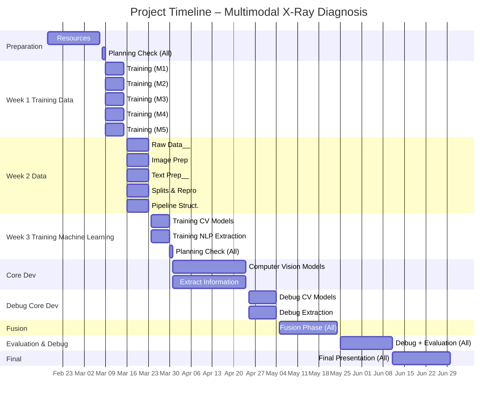

## Planning

<table>
  <thead>
    <tr>
      <th>Task</th>
      <th>Responsable</th>
      <th>Details</th>
      <th>Date (Planned)</th>
      <th>Date (Completed)</th>
    </tr>
  </thead>
  <tbody>
    <tr>
      <td>Collective ML/DL Phase & Resources</td>
      <td>All</td>
      <td>study core ML/DL resources to build a shared foundation, ensuring everyone understands key concepts, tools, and frameworks before starting the technical work. Reading books/resources (StatLearning, scikit-learn, D2L, PyTorch videos, Hugging Face)</td>
      <td>Feb 18 – Mar 1</td>
      <td></td>
    </tr>
    <tr>
      <td>Check planning</td>
      <td>All</td>
      <td>review the project timeline, adjust priorities if needed, and ensure alignment before entering the formation phase.</td>
      <td>Mar 2</td>
      <td></td>
    </tr>
    <tr>
      <td>Formation Raw Data Manager</td>
      <td>Member 1</td>
      <td>familiarizes himself with the dataset structure, learns how to organize and validate labels, identifies potential raw data issues, and practices generating preliminary statistics and quality indicators to understand dataset reliability.</td>
      <td>Mar 9 – Mar 15</td>
      <td></td>
    </tr>
    <tr>
      <td>Formation Image Preprocessing and image quality</td>
      <td>Member 2</td>
      <td> studies image quality assessment techniques, experiments with brightness and intensity metrics, and explores how preprocessing choices (normalization, resizing, filtering) influence medical image interpretation.</td>
      <td>Mar 9 – Mar 15</td>
      <td></td>
    </tr>
    <tr>
      <td>Formation Image Preprocessing and image quality</td>
      <td>Member 3</td>
      <td>learns how to analyze radiology reports, tests multiple text‑cleaning strategies, and explores linguistic patterns, inconsistencies, and noise sources to understand the challenges of medical text processing.</td>
      <td>Mar 9 – Mar 15</td>
      <td></td>
    </tr>
    <tr>
      <td>Formation Split, Distribution and Reproducibility</td>
      <td>Member 4</td>
      <td>studies dataset splitting strategies, learns to detect class imbalance and patient‑level leakage, and prepares the tools and environment required to ensure reproducible experiments across the entire project.</td>
      <td>Mar 9 – Mar 15</td>
      <td></td>
    </tr>
    <tr>
      <td>Formation Pipeline Structure and Consistency Checks</td>
      <td>Member 5</td>
      <td>explores pipeline design principles, experiments with defining consistent input formats for images and text, and reviews multimodal architectures to understand how different components will interact in the final system</td>
      <td>Mar 9 – Mar 15</td>
      <td></td>
    </tr>
    <tr>
      <td>Raw Data Manager</td>
      <td>Member 1</td>
      <td> performs the complete dataset download, executes raw cleaning procedures, computes full global statistics, and produces the official data quality report used for downstream tasks.</td>
      <td>Mar 16 – Mar 23</td>
      <td></td>
    </tr>
    <tr>
      <td>Image Preprocessing and image quality</td>
      <td>Member 2</td>
      <td>implements the full image quality assessment workflow, computes all required image statistics, and develops a functional preprocessing module ready for integration into the training pipeline.</td>
      <td>Mar 16 – Mar 23</td>
      <td></td>
    </tr>
    <tr>
      <td>Image Preprocessing and image quality</td>
      <td>Member 3</td>
      <td>cleans radiology reports at scale, computes finalized text statistics, and systematically flags incomplete, inconsistent, or ambiguous documents to improve dataset reliability.</td>
      <td>Mar 16 – Mar 23</td>
      <td></td>
    </tr>
    <tr>
      <td>Split, Distribution and Reproducibility</td>
      <td>Member 4</td>
      <td>produces the final dataset split, validates class balance, ensures patient‑level consistency, and finalizes the reproducible environment used for all future experiments.</td>
      <td>Mar 16 – Mar 23</td>
      <td></td>
    </tr>
    <tr>
      <td>Pipeline Structure and Consistency Checks</td>
      <td>Member 5</td>
      <td>builds the functional pipeline skeleton, defines precise input/output formats, generates mock data for testing, and consolidates insights from the literature review to ensure structural consistency.</td>
      <td>Mar 16 – Mar 23</td>
      <td></td>
    </tr>
    <tr>
      <td>Formation Implement computer vision models</td>
      <td>Member 1, 2, 4</td>
      <td>study medical image classification architectures, explore transfer learning strategies, analyze common pitfalls in medical imaging, and experiment with preprocessing and augmentation techniques on small prototypes.</td>
      <td>Mar 24 – Apr 30</td>
      <td></td>
    </tr>
    <tr>
      <td>Formation extract information</td>
      <td>Member 3, 5</td>
      <td>study NLP methods for medical text, explore different representation strategies (tokens, embeddings, sentence vectors), and prototype simple extraction pipelines to understand the challenges of clinical language.</td>
      <td>Mar 24 – Apr 30</td>
      <td></td>
    </tr>
    <tr>
      <td>Check planning</td>
      <td>All</td>
      <td>review progress, adjust the timeline if necessary, and ensure that the transition from formation to implementation is smooth and coherent.</td>
      <td>Apr 30</td>
      <td></td>
    </tr>
    <tr>
      <td>Implement computer vision models</td>
      <td>Member 1, 2, 4</td>
      <td>implement full medical image classification models, integrating preprocessing, augmentation, validation strategies, and transfer learning into a coherent and scalable training pipeline.</td>
      <td>Mar 31 – Apr 24</td>
      <td></td>
    </tr>
    <tr>
      <td>extract information</td>
      <td>Member 3, 5</td>
      <td>develop NLP pipelines capable of extracting structured information from radiology reports, using appropriate text‑processing, feature extraction, and modeling techniques.</td>
      <td>Mar 31 – Apr 24</td>
      <td></td>
    </tr>
    <tr>
      <td>debug Implement computer vision models</td>
      <td>Member 1, 2, 4</td>
      <td>debug the computer vision models, investigate failure cases, refine preprocessing and training parameters, and cross‑review each other’s work to strengthen model robustness.</td>
      <td>Apr 25 - May 4</td>
      <td></td>
    </tr>
    <tr>
      <td>debug extract information</td>
      <td>Member 3, 5</td>
      <td> debug the NLP extraction pipeline, analyze incorrect outputs, refine text‑processing steps, and validate the consistency of extracted information.</td>
      <td>Apr 25 – May 4</td>
      <td></td>
    </tr>
    <tr>
      <td>Individual Finalization + Fusion</td>
      <td>All</td>
      <td>Finalize individual components, start multimodal integration. everyone will participate because everyone needs to implement his precedent task to the fusion. In this part, we'll also study codes and system that already work for what we want to do and observe how it works - this will be the first days of the multimodal fusion.</td>
      <td>May 5 – May 24</td>
      <td></td>
    </tr>
    <tr>
      <td>Debug / Evaluation & Interpretation</td>
      <td>All</td>
      <td>evaluate the multimodal model, interpret performance metrics, identifie weaknesses, and perform final debugging through collaborative review to ensure system reliability.</td>
      <td>May 25 – Jun 11</td>
      <td></td>
    </tr>
    <tr>
      <td>Final Presentation</td>
      <td>All</td>
      <td>prepare the final presentation, design clear and structured slides, rehearse the delivery, and incorporate supervisor feedback to produce a polished and professional final result</td>
      <td>Jun 11 – End</td>
      <td></td>
    </tr>
  </tbody>
</table>

---