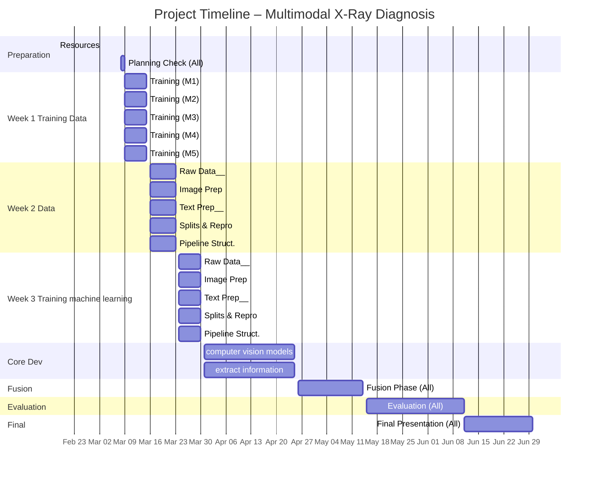

## Planning

<table>
  <thead>
    <tr>
      <th>Task</th>
      <th>Responsable</th>
      <th>Details</th>
      <th>Date (Planned)</th>
      <th>Date (Completed)</th>
    </tr>
  </thead>
  <tbody>
    <tr>
      <td>Collective ML/DL Phase & Resources</td>
      <td>All</td>
      <td>Reading books/resources (StatLearning, scikit-learn, D2L, PyTorch videos, Hugging Face)</td>
      <td>Feb 18 – Mar 1</td>
      <td></td>
    </tr>
    <tr>
      <td>Check planning</td>
      <td>All</td>
      <td>Checking and uptading the planning if necessary</td>
      <td>Mar 2</td>
      <td></td>
    </tr>
    <tr>
      <td>Formation Raw Data Manager</td>
      <td>Member 1</td>
      <td>Organize label, Download dataset, perform raw cleaning, run global statistics, produce a first data quality report</td>
      <td>Mar 3 – Mar 14</td>
      <td></td>
    </tr>
    <tr>
      <td>Formation Image Preprocessing and image quality</td>
      <td>Member 2</td>
      <td>Organize label, Inspect image quality, compute image statistics : brightness histogram, pixel intensity distribution, image size distribution, Start designing the image preprocessing function</td>
      <td>Mar 3 – Mar 14</td>
      <td></td>
    </tr>
    <tr>
      <td>Formation Image Preprocessing and image quality</td>
      <td>Member 3</td>
      <td>Organize label, Inspect radiology report, clean text, compute text statistics : report length distribution, vocab size, term frequencies, identify incomplete ort inconsistent report</td>
      <td>Mar 3 – Mar 14</td>
      <td></td>
    </tr>
    <tr>
      <td>Formation Split, Distribution and Reproducibility</td>
      <td>Member 4</td>
      <td>Organize label, Analyse label distribution, identify class imbalance, check patient-level consistency prepare the project environment</td>
      <td>Mar 3 – Mar 14</td>
      <td></td>
    </tr>
    <tr>
      <td>Formation Pipeline Structure and Consistency Checks</td>
      <td>Member 5</td>
      <td>Organize label, Build skeleton of the training pipeline, Define expected intput formats (image tensors, text vectors), Create mock data for testing, start litteratur reviex on multimodal pipelines</td>
      <td>Mar 3 – Mar 14</td>
      <td></td>
    </tr>
    <tr>
      <td>Check planning</td>
      <td>All</td>
      <td>Checking and uptading the planning if necessary</td>
      <td>Mar 15</td>
      <td></td>
    </tr>
    <tr>
      <td>Raw Data Manager</td>
      <td>Member 1</td>
      <td>Download dataset, perform raw cleaning, run global statistics, produce a first data quality report</td>
      <td>Mar 16 – Mar 29</td>
      <td></td>
    </tr>
    <tr>
      <td>Image Preprocessing and image quality</td>
      <td>Member 2</td>
      <td>Inspect image quality, compute image statistics : brightness histogram, pixel intensity distribution, image size distribution, Start designing the image preprocessing function</td>
      <td>Mar 16 – Mar 29</td>
      <td></td>
    </tr>
    <tr>
      <td>Image Preprocessing and image quality</td>
      <td>Member 3</td>
      <td>Inspect radiology report, clean text, compute text statistics : report length distribution, vocab size, term frequencies, identify incomplete ort inconsistent report</td>
      <td>Mar 16 – Mar 29</td>
      <td></td>
    </tr>
    <tr>
      <td>Split, Distribution and Reproducibility</td>
      <td>Member 4</td>
      <td>Analyse label distribution, identify class imbalance, check patient-level consistency prepare the project environment</td>
      <td>Mar 16 – Mar 29</td>
      <td></td>
    </tr>
    <tr>
      <td>Pipeline Structure and Consistency Checks</td>
      <td>Member 5</td>
      <td>Build skeleton of the training pipeline, Define expected intput formats (image tensors, text vectors), Create mock data for testing, start litteratur reviex on multimodal pipelines</td>
      <td>Mar 16 – Mar 29</td>
      <td></td>
    </tr>
    <tr>
      <td>Implement computer vision models</td>
      <td>Member 1, 2, 4</td>
      <td>Implement computer vision models for medical image classification (data preprocessing, augmentation, and validation strategies). Investigate transfer learning methods. Everyone will have to participate because it is linked with what everyone worked at the last step.</td>
      <td>Mar 30 – Apr 25</td>
      <td></td>
    </tr>
    <tr>
      <td>extract information</td>
      <td>Member 3, 5</td>
      <td>Use NLP methods to extract information from medical reports.Everyone will have to participate because it is linked with what everyone worked at the last step.</td>
      <td>Mar 30 – Apr 25</td>
      <td></td>
    </tr>
    <tr>
      <td>Individual Finalization + Fusion</td>
      <td>All</td>
      <td>Finalize individual components, start multimodal integration. everyone will participate because everyone needs to implement his precedent task to the fusion</td>
      <td>Apr 26 – May 14</td>
      <td></td>
    </tr>
    <tr>
      <td>Evaluation & Interpretation</td>
      <td>All</td>
      <td>Systematic model comparison, metrics, explainability, vision/text relationship</td>
      <td>May 15 – Jun 11</td>
      <td></td>
    </tr>
    <tr>
      <td>Final Presentation</td>
      <td>All</td>
      <td>Prepare slides, rehearsals, supervisor feedback</td>
      <td>Jun 11 – End</td>
      <td></td>
    </tr>
  </tbody>
</table>

---